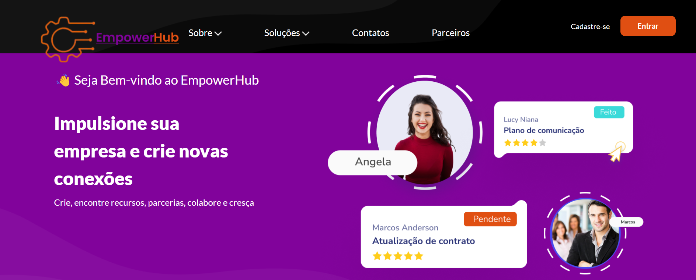

# EmpowerHub
### Projeto Integrador referente ao curso da Proz - Talento Cloud

## Objetivos
**Visa a construção de uma Central de recursos para pequenos negócios.** 

* Oferta de suporte, orientação e recursos para pequenos empresários, ajudando-os a superar desafios e a expandir seus negócios.

* Apoiar pequenos empresários: Fornecer recursos e orientações para resolver problemas comuns enfrentados por pequenos negócios.

* Centralizar informações e ferramentas: Disponibilizar conteúdo educativo, modelos de documentos, ferramentas de gestão, e acesso a consultorias.

* Facilitar o networking: Conectar empresários com mentores, especialistas, e outros pequenos negócios para troca de experiências e suporte mútuo.

Promover a continuidade dos negócios: Reduzir as taxas de falência e desistência entre pequenos empresários.

## Usuários Alvo
**Pequenos empresários que enfrentam dificuldades para gerenciar, expandir ou manter seus negócios.**

* Startups e empreendedores que estão começando e precisam de orientação.

* Consultores e mentores dispostos a oferecer suporte.

